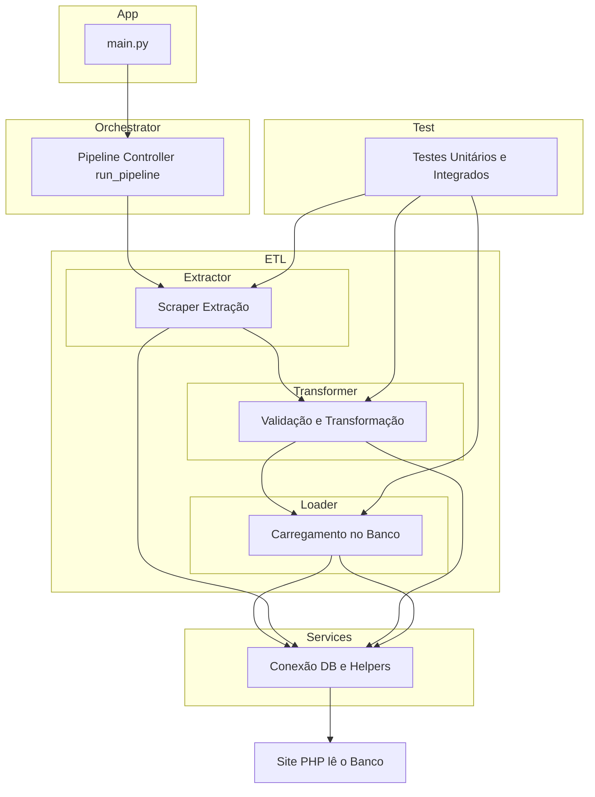

# ETL Feiras Livres

```mermaid
flowchart TD
    subgraph ETL
        subgraph Extractor
            EX[Scraper Extração]
        end
        subgraph Transformer
            TR[Validação e Transformação]
        end
        subgraph Loader
            LD[Carregamento no Banco]
        end
    end

    subgraph Services
        DB[Conexão DB e Helpers]
    end

    subgraph Orchestrator
        ORCH[Pipeline Controller run_pipeline]
    end

    subgraph App
        MAIN[main.py]
    end

    subgraph Test
        TEST[Testes Unitários e Integrados]
    end

    %% Fluxo de dados
    MAIN --> ORCH
    ORCH --> EX
    EX --> TR
    TR --> LD
    LD --> DB
    DB --> Site[Site PHP lê o Banco]
    
    %% Conexões de apoio
    EX --> DB
    TR --> DB
    LD --> DB
    TEST --> EX
    TEST --> TR
    TEST --> LD

```
