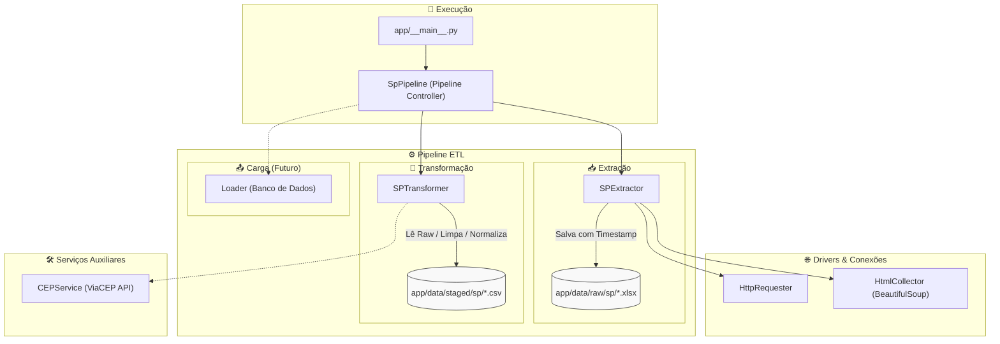

# 🛒 ETL Feiras Livres

Pipeline de **Extração, Transformação e Carga (ETL)** para coleta, padronização e enriquecimento de dados públicos sobre feiras livres municipais (iniciando pela cidade de São Paulo).

---

## 📌 Sumário
- [Visão Geral e Arquitetura](#-visão-geral-e-arquitetura)
- [Estrutura de Pastas](#-estrutura-de-pastas)
- [Dependências](#-dependências)
- [Como Rodar o Projeto](#-como-rodar-o-projeto)
- [Organização de Datas, Versionamento e Cache](#-organização-de-datas-versionamento-e-cache)
- [Fluxo de Transformação dos Dados](#-fluxo-de-transformação-dos-dados)

---

## 🏗️ Visão Geral e Arquitetura

O projeto foi desenhado com arquitetura modular, orientada a objetos e extensível para suportar múltiplas cidades e fontes de dados:



---

## 📁 Estrutura de Pastas

```text
etl-feiras/
│
├── app/                                 # Código-fonte principal da aplicação
│   ├── __main__.py                      # Ponto de entrada para execução via 'python -m app'
│   │
│   ├── cache/                           # Diretório reservado para dados temporários e cache geral
│   │
│   ├── config/                          # Configurações gerais e mapeamentos
│   │   ├── __init__.py                  # Exporta constantes de configuração
│   │   └── urls.py                      # URLs e endpoints dos portais de dados (Sites, URLS)
│   │
│   ├── data/                            # Armazenamento e versionamento dos dados do pipeline
│   │   ├── raw/                         # Dados brutos coletados diretamente das fontes
│   │   │   ├── sp/                      # Arquivos brutos de São Paulo (.xlsx)
│   │   │   └── szn/                     # Estrutura para expansão de outras regiões/fontes
│   │   └── staged/                      # Dados limpos, tratados e padronizados
│   │       └── sp/                      # Arquivos transformados de São Paulo (.csv)
│   │
│   ├── drivers/                         # Adaptadores de rede e raspagem de dados
│   │   ├── __init__.py
│   │   ├── html_collector.py            # Coleta e parsing de páginas HTML com BeautifulSoup
│   │   └── http_requester.py            # Requisições HTTP com controle de status e sessão
│   │
│   ├── etl/                             # Camada principal do pipeline ETL
│   │   ├── extractors/                  # Módulos de extração de dados
│   │   │   ├── __init__.py
│   │   │   ├── extractor.py             # Classe base abstrata Extractor (cache, validação e gravação)
│   │   │   └── sp.py                    # SPExtractor: scraper e download dos dados de SP
│   │   │
│   │   ├── loaders/                     # Módulos para persistência e carga em bancos de dados
│   │   │
│   │   └── transformers/                # Módulos de limpeza e normalização
│   │       ├── __init__.py
│   │       ├── transformer.py           # Classe base abstrata Transformer (regras de estágio e cache)
│   │       └── sp.py                    # SPTransformer: padronização de colunas e tipos de SP
│   │
│   ├── pipelines/                       # Orquestradores ponta a ponta dos fluxos ETL
│   │   ├── __init__.py                  # Exporta pipelines disponíveis
│   │   └── sp_pipeline.py               # SpPipeline: orquestração do fluxo de São Paulo
│   │
│   ├── services/                        # Serviços de integração externa e regras de negócio
│   │   ├── __init__.py
│   │   └── cep_service.py               # Integração com a API ViaCEP para enriquecimento de endereços
│   │
│   └── tests/                           # Testes unitários e de integração
│
├── .env                                 # Variáveis de ambiente (chaves de API, credenciais)
├── .gitignore                           # Arquivos e diretórios ignorados pelo Git
├── requirements.txt                     # Lista de dependências e bibliotecas Python
└── README.md                            # Documentação do projeto
```

---

## 📦 Dependências

O projeto utiliza **Python 3.10+** e as seguintes bibliotecas principais:

| Biblioteca | Versão | Finalidade |
| :--- | :--- | :--- |
| **`requests`** | `2.32.5` | Requisições HTTP para os portais da prefeitura e API ViaCEP |
| **`beautifulsoup4`** | `4.14.3` | Parsing de páginas HTML e extração de links dinâmicos de download |
| **`pandas`** | `3.0.1` | Manipulação estruturada de dados, limpeza, renomeação e exportação CSV |
| **`openpyxl`** | `3.1.5` | Motor de leitura de arquivos Excel (`.xlsx`) no Pandas |
| **`numpy`** | `2.4.2` | Suporte a estruturas de dados e operações numéricas de alto desempenho |
| **`python-dateutil`** | `2.9.0.post0` | Manipulação e cálculo de datas e expiração de cache |
| **`tzdata`** | `2025.3` | Suporte a fusos horários universais (UTC) |

---

## 🚀 Como Rodar o Projeto

### 1. Pré-requisitos
- **Python 3.10** ou superior instalado no sistema.
- **Git** instalado para clonar o repositório.

### 2. Criar e ativar o ambiente virtual

**No Windows (PowerShell):**
```powershell
python -m venv .venv
.\.venv\Scripts\Activate.ps1
```

**No Linux / macOS (Bash):**
```bash
python3 -m venv .venv
source .venv/bin/activate
```

### 3. Instalar as dependências
```bash
pip install -r requirements.txt
```

### 4. Executar o Pipeline
Execute o módulo principal da aplicação:
```bash
python -m app
```

Ao executar, o pipeline:
1. Verifica se já existem dados brutos recentes em cache (`app/data/raw/sp/`). Caso não existam ou estejam expirados, faz o download do arquivo atualizado da Prefeitura de SP.
2. Verifica se a transformação intermediária já está em cache (`app/data/staged/sp/`). Caso contrário, aplica a limpeza, normalização de cabeçalhos e salva o novo CSV transformado.
3. Exibe uma prévia dos dados processados no console.

---

## 🕒 Organização de Datas, Versionamento e Cache

O projeto possui uma estratégia de gerenciamento temporal tanto na persistência física dos arquivos quanto no ciclo de vida dos dados:

### 1. Nomenclatura de Arquivos com Timestamp UTC
Todos os arquivos gerados nas etapas de extração (`raw`) e transformação (`staged`) recebem um prefixo temporal gerado em **UTC** no formato `YYYYMMDD_HHMMSS`:

- **Exemplo de Dado Bruto (Raw):**
  ```text
  app/data/raw/sp/20260329_053313_sp_raw_data.xlsx
  ```
- **Exemplo de Dado em Estágio (Staged):**
  ```text
  app/data/staged/sp/20260501_223700_sp_transform.csv
  ```

> **Vantagens dessa convenção:**
> - Histórico e rastreabilidade temporal de quando cada extração e transformação foi executada.
> - Ordenação cronológica natural pelo nome dos arquivos no sistema de arquivos.

### 2. Mecanismo de Cache e Expiração (`CACHE_MAX_AGE`)
As classes base `Extractor` e `Transformer` controlam a expiração temporal dos arquivos:

- **Idade máxima de validade (`CACHE_MAX_AGE`):** Definida por padrão em **365 dias** (`timedelta(days=365)`).
- **Identificação do arquivo mais recente (`_get_latest_file`):** Localiza o arquivo com a data de modificação (`st_mtime`) mais recente no diretório da região.
- **Validação de expiração (`_is_file_expired`):** Compara `datetime.now(timezone.utc) - data_do_arquivo` com o limite `CACHE_MAX_AGE`.
  - Se estiver **válido**: O arquivo existente é reutilizado em memória, poupando requisições e processamento redundante.
  - Se estiver **expirado**: O arquivo antigo é removido (`_delete_if_expired`) e um novo lote atualizado é baixado/processado.

---

## 🔄 Fluxo de Transformação dos Dados

Na etapa do `SPTransformer`, as colunas originais do arquivo da prefeitura são tratadas e padronizadas:

| Coluna Original (Excel) | Coluna Padronizada (CSV / Staged) | Tratamento Realizado |
| :--- | :--- | :--- |
| `CÓDIGO DE REGISTRO` | `codigo_feira` | Remoção de espaços extras |
| `DIA DA SEMANA` | `dia` | Padronização de texto |
| `CATEGORIA` | `categoria` | Padronização de categoria da feira |
| `QUANTIDADE DE FEIRANTES` | `numero_feirantes` | Conversão e limpeza |
| `ENDEREÇO` | `endereco` | Normalização de caracteres e espaços |
| `NÚMERO` | `numero` | Conversão para tipo string (`str`) |
| `BAIRRO` | `bairro` | Remoção de espaços e caracteres invisíveis |
| `REFERÊNCIA` | `referencia` | Tratamento de valores nulos |
| `SUBPREFEITURA` | `subprefeitura` | Padronização textual |

Também são executados tratamentos globais:
- Remoção de caracteres especiais de espaçamento (`\xa0` / espaços múltiplos).
- `strip()` em todas as colunas de texto.
- Substituição de valores nulos (`NaN`) por string vazia (`fillna("")`).

